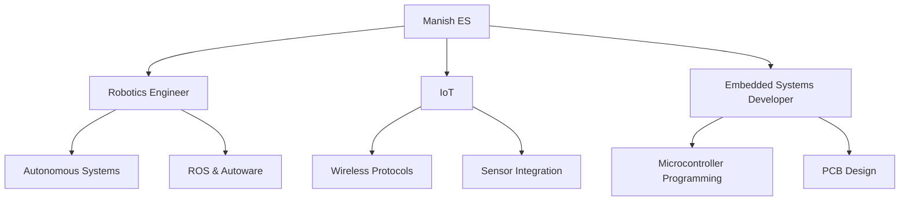

<div align="center">
 

<h1>Hello World, I'm Manish ES</h1>
</div>

<p align='center'>
   <a href="https://www.linkedin.com/in/manish-e-s-5b242514b/"></a>&nbsp;&nbsp;
</p>

<div align="center">



</div>

## `Skills.compile()`
```python
skills = {
    'Languages': ['C++', 'Python', 'MATLAB'],
    'Frameworks': ['ROS', 'Autoware', 'TensorFlow'],
    'Hardware': ['ARM', 'NVIDIA Jetson', 'ESP32'],
    'Tools': ['Git', 'Docker', 'Simulink', 'KiCAD']
}
```

## `Projects.execute()`
```cpp
while (true) {
    develop(autonomous_vehicles);
    implement(iot_systems);
    research(robotics_applications);
    if (coffee_level < threshold) {
        refill_coffee();
    }
}
```

<div align="center">
- 🔭 I'm currently working on Robotics.
- 🌱 Currently learning Neuroscience and its Engineering.
- 👯 Looking to collaborate on BCI Enthusiasts.
- ⚡ Fact: "Small Tweaks to our brain will make a big difference in our world, as our world is in our brain."
</div>

<div align="center">  
  <p align="center">
    <a href="https://github.com/esmanish/github-readme-stats"> 
      
    </a>
  </p>
</div>

<div align="center">

```
+-----------------------------------------------------+
|                                                     |
|  "Debugging is twice as hard as writing the code    |
|   in the first place. Therefore, if you write the   |
|   code as cleverly as possible, you are, by         |
|   definition, not smart enough to debug it."        |
|                                        - Brian W. Kernighan   |
|                                                     |
+-----------------------------------------------------+
```

</div>

<div align="center">
   
</div>
